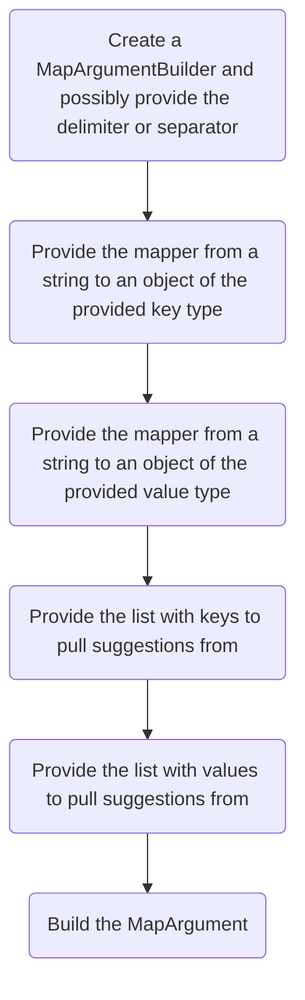

# Map arguments

A `MapArgument` can be used to provide a map of values. This argument uses an underlying `GreedyStringArgument` which means that this argument can only be used at the end of the argument list.
It returns a `LinkedHashMap` object.

## The `MapArgumentBuilder`

Similar to the `ListArgument`, this argument also uses a builder class to construct it.



### Building a `MapArgument`

To start building the argument, you first have to construct a `MapArgumentBuilder` parameterized over the types the key and the value are supposed to have.
If you wanted to construct a `MapArgument` that returns a `LinkedHashMap<String, Integer>` you would construct the `MapArgumentBuilder` like this:

```java
new MapArgumentBuilder<String, Integer>
```

The `MapArgumentBuilder` has three possible constructors:

```java
public MapArgumentBuilder<K, V>(String nodeName);
public MapArgumentBuilder<K, V>(String nodeName, char delimiter);
public MapArgumentBuilder<K, V>(String nodeName, char delimiter, String separator)
```

- `nodeName`: This parameter determines the node name of the `MapArgument`
- `delimiter`: This parameter determines the delimiter. This separates a key from a value (`key:value`). When not provided, it defaults to a colon (`:`)
- `separator`: This parameter determines the separator. This separates one key-value pair from another (`key:value key:value`). When not provided, it defaults to a space <!-- markdownlint-disable-line MD038 -->(` `)

$$\downarrow$$

### Providing mapper functions

The mapper functions are used to parse the argument when entered. Because a `GreedyStringArgument`
returns a `String`, we need a way to convert a `String` into an object specified by the type parameters.

When providing mappers, you first need to provide the key mapper:

```java
public MapArgumentBuilder withKeyMapper(StringParser<K>);
```

You then have to provide the value mapper:

```java
public MapArgumentBuilder withValueMapper(StringParser<V>);
```

`StringParser` is a functional interface with the following definition:

```java
@FunctionalInterface
public interface StringParser<T> {
    /**
     * A method that turns a String into an object of type T.
     *
     * @param s The String to parse
     * @return The resulting parsed object
     * @throws WrapperCommandSyntaxException If there is a problem with the syntax of the String that prevents it from being turned into an object of type T.
     */
    T parse(String s) throws WrapperCommandSyntaxException;
}
```

This signature allows you to throw exceptions using the `CommandAPI.fail...` methods if the given String cannot be parsed (see [Handling command failures](../../executors/handle-failures)).

$$\downarrow$$

### Providing suggestions

When providing suggestions, you have the choice whether players are allowed to enter any key/value pair or only key/value pairs specified by the `MapArgument`.
To accomplish this the `MapArgumentBuilder` provides different methods.

Similar to the mappers, you first have to provide the key suggestions:

:::tabs key:mapargs
===Only certain values (recommended)
```java
public MapArgumentBuilder withKeyList(List<String> keyList);
```
===Any value
```java
public MapArgumentBuilder withoutKeyList();
```
:::

Next, you have to provide the value suggestions. In addition to the two possibilities presented for the key suggestions, here you also have the possibility to define
whether a value can be written multiple times.

:::tabs key:mapargs
===Only certain values (recommended)
```java
public MapArgumentBuilder withValueList(List<String> valueList);

public MapArgumentBuilder withValueList(List<String> valueList, boolean allowValueDuplicates);
```
===Any value
```java
public MapArgumentBuilder withoutValueList();

public MapArgumentBuilder withoutValueList(boolean allowDuplicates)
```
:::

If you choose to allow a value to be written multiple times, you have to set `allowValueDuplicates` to `true`. By default, it is set to `false` and
does not allow values to be written multiple times.

$$\downarrow$$

### Building the `MapArgument`

To finish building the `MapArgument`, you have to call the `build()` method. This will return a new `MapArgument` object.

```java
public MapArgument<K, V> build();
```

## Examples

::::tip Example - `/sendmessage` command

Let's say we want to create a command that we can execute to send multiple players messages without typing the command more than once. For that, we create a command with the following syntax:

```mccmd
/sendmessage <message>
```

To implement that, we create a command that uses a `MapArgument` and use `Player` objects as keys and `String` objects as values:

:::tabs
===Java
<<< @/../reference-code/src/main/java/createcommands/arguments/types/MapArguments.java#mapArgumentsExample
===Kotlin
<<< @/../reference-code/src/main/kotlin/createcommands/arguments/types/MapArguments.kt#mapArgumentsExample
===Kotlin DSL
<<< @/../reference-code/src/main/kotlin/createcommands/arguments/types/MapArguments.kt#mapArgumentsExampleDSL
:::

:::danger Developer's Note:

The `MapArgument` is very strict and doesn't have room for any errors. A key must always be followed by the delimiter, then a value. One value and the next key must always be separated by the separator. Both keys and values also have the option to be surrounded by quotes.

For example, let's say you are on a server with two players, `Player1` and `Player2`. We want to send both of them the message `Hello, <playerName>!`
To do that, we use the previously declared `sendmessage` command like this:

```mccmd
/sendmessage Player1:"Hello, Player1!" Player2:"Hello, Player2!"
```

A colon is used as the delimiter and a space as the separator because those are the defaults, and neither was specified in the `MapArgumentBuilder` constructor. Since the separator was a space, the messages were surrounded by quotes to avoid the spaces inside them from being misinterpreted as the start of the next key-value pair.

:::

::::